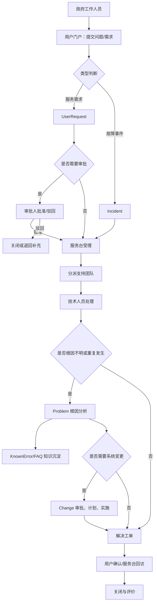

# iTop Java 版本需求分析与 PRD

## 0. 文档信息

| 字段 | 内容 |
| --- | --- |
| 功能名称 | 基于 PHP iTop 的 Java 版 ITSM/CMDB 平台补齐 |
| 需求类型 | PRD-standard + 开发交接附录 |
| 当前状态 | 草稿，可用于反馈 Java 版功能缺口和拆分研发任务 |
| 关联模块 | 用户门户、服务台、工单流转、事件、问题、已知错误、变更、CMDB、组织、账号、角色、权限、服务目录、SLA、仪表盘、部署 |
| 基准来源 | `F:\ITop\iTop` PHP/iTop 源码，`F:\ITop-java` Java/Vue 版本源码，本地 Docker demo 观察 |
| 更新时间 | 2026-08-06 |

本期只解决 Java 版从“轻量 CMDB 原型”升级为“可完成政府工作人员提单、服务台流转、技术团队处理、知识沉淀、变更闭环的 iTop 类 ITSM demo 系统”。

## 1. 背景与目标

### 1.1 背景

当前已有两套系统参照：

| 系统 | 定位 | 当前观察 |
| --- | --- | --- |
| PHP/iTop 官方项目 | 成熟 ITSM + CMDB 平台 | 具备模块化数据模型、组织/人员/权限、用户门户、服务请求、事件、问题、已知错误、变更、服务目录、SLA、仪表盘、菜单、审计等能力 |
| Java 版 `F:\ITop-java` | Java + Spring Boot + Vue 3 重写版本 | 已有认证、组织、用户、角色、服务器、CI、仪表盘雏形，但还没有形成完整 ITSM 工单流转体系 |

用户当前目标不是完整复刻 PHP/iTop 的所有企业级配置能力，而是先做一个能演示的管理体系：政府工作人员提出问题或需求，服务台受理，按组织和角色流转给技术团队处理，必要时沉淀为问题、已知错误、FAQ 或变更，最终关闭并可统计。

### 1.2 功能目标

1. 建立可演示的组织、用户、团队、角色、权限模型。
2. 建立服务台入口，使政府工作人员可以提交问题、需求、查询进度、查看知识库。
3. 建立后台工单处理流程，使服务台和技术团队可以分派、处理、转派、挂起、解决、关闭。
4. 建立 CMDB 与工单的关联，使工单能关联服务器、应用、网络设备等配置项。
5. 建立问题管理、已知错误、FAQ、变更管理的最小闭环。
6. 建立仪表盘和报表，使管理员能看到待办、超时、流转效率和资产概况。
7. 建立 Docker 本地与服务器部署规范，避免影响服务器其他服务。

### 1.3 成功标准

| 维度 | 成功标准 |
| --- | --- |
| Demo 可用性 | 管理员能创建组织、账号、角色；普通政府工作人员能登录门户提交工单；服务台能受理并分派；技术人员能处理并关闭 |
| iTop 对齐度 | Java 版至少覆盖 PHP/iTop 核心 ITIL 链路：UserRequest、Incident、Problem、KnownError、Change、Service、SLA、CMDB |
| 权限正确性 | 不同组织和角色只能看到自己可访问范围内的数据；管理员能跨组织管理 |
| 数据真实性 | Dashboard 不再依赖静态 mock，能从真实工单、组织、CI、用户数据统计 |
| 可部署性 | 本地 Docker 可一键启动；阿里服务器部署使用独立端口、独立目录、独立数据卷，不影响已有服务 |
| 可验收性 | 每个核心页面和流程都有明确测试用例、测试数据和预期结果 |

### 1.4 非目标

1. 不要求完整实现 PHP/iTop 所有扩展、插件市场、主题、低代码 datamodel 编译器。
2. 不要求首版支持 LDAP、CAS、OAuth、SAML 的真实接入，只保留认证方式字段和后续扩展点。
3. 不要求首版实现复杂邮件网关、自动监控告警接入、自动派单算法。
4. 不要求首版复刻 PHP/iTop 所有 CI 类型，先覆盖 demo 所需资产。
5. 不要求首版支持多语言后台配置，但必须修复当前中文乱码问题。

## 2. PHP/iTop 基准能力理解

### 2.1 PHP/iTop 的核心设计思想

PHP/iTop 不是单纯的资产管理系统，而是“CMDB + ITSM 流程 + 服务目录 + 权限组织 + 仪表盘”的组合平台。

它的核心特征：

1. 以组织为数据边界，组织可作为客户、服务提供方、供应商或内部部门。
2. 以联系人和用户区分真实人员与登录账号，一个人可以关联一个登录用户。
3. 以配置项 CI 作为资产基础，服务器、应用、网络设备、数据库、文档、合同等都是可管理对象。
4. 以 Ticket 作为工单基础，UserRequest、Incident、Problem、Change 等是不同流程对象。
5. 以状态机驱动流转，不同状态下字段必填、只读、可见和可执行动作不同。
6. 以服务目录、SLA、TTO、TTR 支撑服务承诺和超时升级。
7. 以 Portal 支撑普通用户自助提交、查询和 FAQ 浏览。
8. 以 Dashboard/Dashlet/OQL 查询动态生成统计，而不是固定写死页面数据。

### 2.2 PHP/iTop 主要模块对应

| PHP/iTop 模块 | Java 版应理解为 | 首版是否需要 |
| --- | --- | --- |
| `authent-local` | 本地账号密码登录 | 需要 |
| `authent-ldap`、`authent-cas`、`authent-external` | 外部认证扩展 | 暂缓，保留字段 |
| `itop-structure` | 组织、联系人、团队、位置等基础结构 | 需要 |
| `itop-config-mgmt` | CMDB 基础模型 | 需要 |
| `itop-datacenter-mgmt` | 服务器、机柜、设备等数据中心资产 | 部分需要 |
| `itop-endusers-devices` | 终端设备、打印机、电话等 | P2 |
| `itop-service-mgmt` | 服务、子服务、合同、服务目录 | 需要 |
| `itop-sla-computation` | SLA、TTO、TTR、升级计算 | P1 |
| `itop-request-mgmt` / `itop-request-mgmt-itil` | 用户服务请求 | P0 |
| `itop-incident-mgmt-itil` | 事件管理 | P0 |
| `itop-problem-mgmt` | 问题管理 | P1 |
| `itop-knownerror-mgmt` | 已知错误 | P1 |
| `itop-faq-light` | FAQ 知识库 | P1 |
| `itop-change-mgmt` / `itop-change-mgmt-itil` | 变更管理 | P1 |
| `itop-portal` / `itop-portal-base` | 用户门户 | P0 |
| `itop-welcome-itil` | 首页概览和 dashboard | P0 |
| `itop-attachments` | 附件 | P1 |
| `itop-backup`、`combodo-db-tools` | 备份和数据库工具 | P2 |

### 2.3 PHP/iTop 关键工单对象

| 对象 | 中文含义 | 主要用途 | 典型状态 |
| --- | --- | --- | --- |
| `UserRequest` | 用户需求/服务请求 | 用户需要办理、咨询、开通、变更权限、报修等 | new、assigned、waiting_for_approval、approved、rejected、pending、resolved、closed、escalated_tto、escalated_ttr |
| `Incident` | 事件 | 已经影响服务可用性或正常工作的故障 | new、assigned、pending、resolved、closed、escalated_tto、escalated_ttr |
| `Problem` | 问题 | 多个事件背后的根因分析和长期治理 | new、assigned、resolved、closed |
| `KnownError` | 已知错误 | 已确认但未彻底修复的问题、临时绕行方案和最终方案 | 无强状态机，强调症状、根因、绕行方案、解决方案 |
| `Change` | 变更 | 对服务、系统、资产进行有计划的调整 | new、assigned、planned、approved、rejected、closed；ITIL 版还包括 validated、implemented、monitored、notapproved |

### 2.4 PHP/iTop 后台与门户分工

| 入口 | 面向用户 | 功能 |
| --- | --- | --- |
| 后台 Console | 管理员、服务台、技术团队、流程负责人 | 组织、账号、角色、CMDB、工单、问题、变更、服务目录、SLA、Dashboard |
| 用户 Portal | 政府工作人员、业务部门用户 | 提交需求/故障、查看我的工单、补充信息、确认解决、查看 FAQ |

Java 版需要保留这两个入口的产品差异。普通用户不应该进入复杂后台；技术人员不应该只看到普通用户门户。

## 3. Java 版当前状态与主要缺口

### 3.1 当前已具备的能力

| 能力 | 现状 |
| --- | --- |
| 技术架构 | Spring Boot 3、Java 21、PostgreSQL、Flyway、Vue 3、Element Plus、Docker Compose |
| 认证 | `POST /api/auth/login`，JWT 登录 |
| 组织管理 | 后端 `OrganizationController`，前端 `OrganizationList.vue` 已有列表和表单 |
| 用户管理 | 后端 `UserController` 存在，前端 `UserList.vue` 存在但当前路由未挂载 |
| 角色管理 | 后端 `RoleController` 存在，前端 `RoleList.vue` 存在但当前路由未挂载 |
| 权限数据 | `role.permissions` 使用 JSON 字符串保存，默认角色含 `*`、`ci:*`、`org:*` 等 |
| 服务器管理 | 后端 `ServerController` 和前端 `ServerList.vue` 存在 |
| CI 查询 | 后端 `CIController` 和前端 `CIList.vue` 存在 |
| Dashboard | 后端 `DashboardController` 统计组织、用户、CI、服务器；前端 `/dashboard` 调用真实接口 |
| 初始数据 | 默认组织、默认角色、默认管理员 `admin/admin123` |
| 审计表 | 数据库建表包含 `audit_log`，但未看到完整写入闭环 |

### 3.2 当前关键缺口

| 缺口 | 影响 | 优先级 |
| --- | --- | --- |
| 没有用户门户 | 普通政府工作人员无法按 iTop 模式提交和跟踪请求 | P0 |
| 没有工单基础模型 | UserRequest、Incident、Problem、Change 都无法落地 | P0 |
| 没有服务台工作台 | 无法受理、分派、转派、挂起、解决、关闭 | P0 |
| 用户/角色页面未挂菜单 | 已写的用户和角色管理无法正常通过导航使用 | P0 |
| 权限未形成闭环 | 已解析权限，但接口和前端菜单未按权限控制 | P0 |
| 无“可访问组织”模型 | 无法限制不同组织/部门看到的数据范围 | P0 |
| 中文乱码 | 影响所有页面可读性和 demo 可信度 | P0 |
| 无服务目录 | 用户不能按服务/子服务提交请求 | P1 |
| 无 SLA/TTO/TTR | 无法体现响应、解决时限和超时升级 | P1 |
| 无问题/已知错误/FAQ | 无法从重复事件沉淀知识 | P1 |
| 无变更管理 | 无法形成修复方案、审批、计划、实施闭环 | P1 |
| CMDB 类型不足 | 只覆盖服务器等少数 CI，无法支撑真实运维场景 | P1 |
| 附件缺失 | 用户和工程师无法上传截图、文档、日志 | P1 |
| 审计未闭环 | 无法追踪谁改了什么、何时改、从什么值改到什么值 | P1 |
| 部署端口默认暴露 | `80`、`8080`、`5432` 直接暴露，服务器部署有风险 | P1 |

### 3.3 当前 Java 源码观察依据

| 观察点 | 文件 |
| --- | --- |
| 路由仅包含 dashboard、organizations、servers、cis，未挂 users/roles | `F:\ITop-java\itop-web\src\main\frontend\src\router\index.ts` |
| 用户管理页面已存在 | `F:\ITop-java\itop-web\src\main\frontend\src\views\system\UserList.vue` |
| 角色管理页面已存在 | `F:\ITop-java\itop-web\src\main\frontend\src\views\system\RoleList.vue` |
| 角色接口和权限枚举已存在 | `F:\ITop-java\itop-api\src\main\java\com\itop\api\controller\RoleController.java` |
| JWT 过滤器已解析角色和权限 | `F:\ITop-java\itop-api\src\main\java\com\itop\api\security\JwtAuthenticationFilter.java` |
| 安全配置只要求 `/api/**` 已登录，未做细粒度权限 | `F:\ITop-java\itop-api\src\main\java\com\itop\api\config\SecurityConfig.java` |
| 数据库只有组织、联系人、CI、服务器、网络设备、应用、用户、角色、关系、审计表 | `F:\ITop-java\itop-core\src\main\resources\db\migration\V1.0.0__Initial_Schema.sql` |
| Dashboard 目前只统计 CMDB/组织/用户，没有工单指标 | `F:\ITop-java\itop-api\src\main\java\com\itop\api\controller\DashboardController.java` |

## 4. 目标用户、组织与角色模型

### 4.1 Demo 组织结构建议

本 demo 应以“政府工作人员”为业务用户，而不是照搬商业客户名称。建议组织结构如下：

```text
政府单位
├─ 综合办
│  ├─ 行政用户组
│  └─ 文档流转用户组
├─ 财务处
│  ├─ 报销业务用户组
│  └─ 预算业务用户组
├─ 人事处
│  ├─ 入离职业务用户组
│  └─ 考勤业务用户组
├─ 业务办理处
│  ├─ 窗口业务用户组
│  └─ 审批业务用户组
└─ 信息中心
   ├─ 服务台一线
   ├─ 应用运维组
   ├─ 网络运维组
   ├─ 系统运维组
   ├─ 数据库运维组
   └─ 变更审批组
```

### 4.2 组织类型

| 类型 | 含义 | 示例 | 是否可登录 |
| --- | --- | --- | --- |
| `government_unit` | 一级政府单位 | 某市政务服务中心 | 否，本身是组织 |
| `department` | 业务部门 | 财务处、人事处、综合办 | 否，本身是组织 |
| `business_team` | 业务小组 | 报销业务用户组、窗口业务用户组 | 否，本身是组织 |
| `it_provider` | 内部服务提供方 | 信息中心 | 否，本身是组织 |
| `support_team` | 支持团队 | 服务台一线、应用运维组、网络运维组 | 否，本身是组织 |
| `external_vendor` | 外部供应商 | 外包维护厂商 | 可选 |

### 4.3 用户类型

| 用户类型 | 含义 | 登录入口 | 典型能力 |
| --- | --- | --- | --- |
| 管理员 | 系统初始化和全局配置人员 | 后台 | 全组织、全模块、全权限 |
| 政府工作人员 | 提问题、提需求、查进度的人 | 用户门户 | 提交工单、查看自己的工单、评价、查 FAQ |
| 部门联络员 | 某业务部门内部协助汇总需求的人 | 门户 + 简化后台 | 查看本部门工单、代提、补充信息 |
| 服务台坐席 | 一线受理、分类、分派人员 | 后台 | 查看队列、受理、分派、回访、关闭 |
| 技术处理人 | 二线/三线处理问题的人 | 后台 | 接单、转派、处理、挂起、解决 |
| 团队负责人 | 管理某支持团队队列和人员 | 后台 | 分派、重分派、查看团队报表 |
| 问题经理 | 负责根因分析和已知错误 | 后台 | 创建 Problem、KnownError、FAQ |
| 变更经理 | 负责变更流程 | 后台 | 创建/审核/计划/实施/关闭变更 |
| 审批人 | 对服务请求或变更做业务/技术审批 | 门户或后台 | 审批、驳回、备注 |
| 审计员 | 只读检查数据和操作记录 | 后台 | 只读查询、导出报表 |

### 4.4 角色建议

| 角色代码 | 中文名 | 组织范围 | 核心权限 |
| --- | --- | --- | --- |
| `ADMIN` | 系统管理员 | 全局 | 所有配置、所有数据、所有流程 |
| `ORG_ADMIN` | 组织管理员 | 指定组织及子组织 | 组织人员维护、本组织数据查看 |
| `REQUESTER` | 普通提单用户 | 自己所属组织 | 提单、查看本人/本人部门授权工单、评价 |
| `DEPT_COORDINATOR` | 部门联络员 | 所属部门及子组 | 代提、本部门工单跟踪 |
| `SERVICE_DESK` | 服务台坐席 | 信息中心或授权组织 | 受理、分类、分派、关闭 |
| `SUPPORT_AGENT` | 技术处理人 | 所属支持团队 | 处理、挂起、解决、补充工作日志 |
| `SUPPORT_LEAD` | 支持团队负责人 | 所属支持团队 | 分派、重派、查看团队队列 |
| `PROBLEM_MANAGER` | 问题经理 | 授权范围 | 创建问题、关联事件、维护已知错误 |
| `CHANGE_MANAGER` | 变更经理 | 授权范围 | 创建变更、计划、审批推进、关闭 |
| `CMDB_ADMIN` | CMDB 管理员 | 授权范围 | CI、关系、资产维护 |
| `KNOWLEDGE_MANAGER` | 知识管理员 | 授权范围 | FAQ 发布、已知错误发布 |
| `AUDITOR` | 审计员 | 授权范围 | 只读查询、导出、审计日志 |

### 4.5 可访问组织规则

“所属组织”回答用户自己是谁；“可访问组织”回答用户能看哪些数据。

| 规则 | 说明 |
| --- | --- |
| 用户必须有一个主所属组织 | 例如张三属于“财务处/报销业务用户组” |
| 用户可以拥有多个可访问组织 | 例如服务台可访问所有业务部门；应用运维只访问与应用相关组织 |
| 可访问组织默认不等于全局 | 普通用户只能看自己提交或自己组织授权范围内的数据 |
| 组织树支持继承 | 授权“财务处”可选择是否包含其子组织“报销业务用户组”和“预算业务用户组” |
| 管理员可以跨组织 | `ADMIN` 默认全局 |
| 数据查询必须按组织过滤 | 列表、详情、搜索、导出、Dashboard 都必须受组织范围限制 |

## 5. 用户场景

### 5.1 场景一：政府工作人员提交问题

用户：财务处工作人员。

触发：财务系统无法登录，影响报销办理。

流程：

1. 用户进入门户。
2. 选择“我要报故障”。
3. 选择服务“财务系统”、子服务“登录问题”。
4. 填写标题、描述、影响范围、紧急度，上传截图。
5. 系统生成事件工单，状态为 `new`。
6. 服务台收到新工单，确认分类并分派给应用运维组。
7. 技术人员处理，填写处理过程和解决方案。
8. 用户收到通知，确认已解决。
9. 工单关闭，进入统计。

### 5.2 场景二：政府工作人员提交服务需求

用户：人事处工作人员。

触发：新员工入职，需要开通政务办公账号和权限。

流程：

1. 用户进入门户。
2. 选择“我要提需求”。
3. 选择服务“账号权限服务”、子服务“新员工账号开通”。
4. 填写员工姓名、部门、所需系统、期望完成时间。
5. 如果服务配置需要审批，进入 `waiting_for_approval`。
6. 部门联络员或审批人批准后，工单进入服务台队列。
7. 服务台分派给系统运维组。
8. 技术人员完成开通并填写结果。
9. 用户确认，工单关闭。

### 5.3 场景三：多个事件升级为问题和已知错误

用户：服务台、问题经理、技术团队。

触发：多个部门反复反馈同一应用卡顿。

流程：

1. 服务台发现多个 Incident 都关联“政务审批系统”。
2. 问题经理创建 Problem，关联这些 Incident。
3. 技术团队记录根因分析。
4. 如果短期不能彻底修复，创建 KnownError。
5. Knowledge Manager 发布 FAQ，告知临时绕行方案。
6. 后续创建 Change 修复根因。
7. Change 实施完成后，Problem resolved/closed，相关 Incident 批量更新或提示关闭。

### 5.4 场景四：变更审批和实施

用户：变更经理、技术处理人、审批人。

触发：需要升级数据库或发布应用补丁。

流程：

1. 技术人员从 Incident/Problem 发起 Change。
2. 变更经理补充影响范围、实施计划、回滚计划、涉及 CI。
3. 审批人批准或驳回。
4. 批准后进入计划状态。
5. 实施人按计划执行并记录结果。
6. 观察期结束后关闭 Change。

## 6. 核心流程图



## 7. 信息架构与页面范围

### 7.1 后台菜单

| 一级菜单 | 二级菜单 | 用途 | 优先级 |
| --- | --- | --- | --- |
| 工作台 | 总览 Dashboard、我的待办、团队队列、超时提醒 | 让处理人员先看到要做什么 | P0 |
| 服务台 | 新建工单、所有打开工单、分配给我的、我受理的、已升级 | 受理和处理 UserRequest/Incident | P0 |
| 用户门户管理 | 服务目录展示配置、门户公告、FAQ 发布 | 控制普通用户看到什么 | P1 |
| 事件管理 | 新建事件、搜索事件、打开事件、我的事件、升级事件 | 故障处理 | P0 |
| 需求管理 | 新建需求、搜索需求、打开需求、待审批需求 | 服务请求处理 | P0 |
| 问题管理 | 新建问题、搜索问题、我的问题、打开问题 | 根因分析 | P1 |
| 已知错误/FAQ | 已知错误、FAQ 分类、FAQ 文章 | 知识沉淀 | P1 |
| 变更管理 | 新建变更、待审批、已计划、我的变更、所有打开变更 | 变更闭环 | P1 |
| CMDB | 组织、人员、团队、服务器、应用、网络设备、CI 关系 | 资产和关系 | P0/P1 |
| 服务管理 | 服务、子服务、服务家族、SLA、SLT、服务时间 | 服务目录和 SLA | P1 |
| 系统管理 | 用户、角色、权限、可访问组织、审计日志、字典 | 管理后台 | P0/P1 |
| 数据工具 | 导入、导出、备份、恢复 | 数据运维 | P2 |

### 7.2 用户门户页面

| 页面 | 功能 |
| --- | --- |
| 门户首页 | 展示我的待处理、我的最近工单、常用服务、公告、FAQ 搜索 |
| 我要报故障 | 创建 Incident，面向“系统不能用、故障、异常、影响工作” |
| 我要提需求 | 创建 UserRequest，面向“开权限、办事项、咨询、服务申请” |
| 服务目录 | 按服务家族、服务、子服务浏览可申请项 |
| 我的工单 | 查看我提交的、我关注的、等待我补充/确认的工单 |
| 工单详情 | 查看状态、处理记录、附件、服务台回复，补充说明，确认解决 |
| FAQ/知识库 | 搜索常见问题、已知错误、临时绕行方案 |
| 个人信息 | 修改联系方式、语言、通知偏好、密码 |

### 7.3 工单详情页结构

| 区域 | 内容 |
| --- | --- |
| 标题区 | 工单编号、标题、类型、状态、优先级、所属组织、创建时间 |
| 基础信息 | 服务、子服务、影响、紧急度、来源、提交人、联系电话 |
| 分派信息 | 当前团队、当前处理人、服务台坐席、审批人 |
| SLA 信息 | TTO/TTR 截止时间、剩余时间、是否超时、升级原因 |
| 关联对象 | 相关 CI、相关 Incident、相关 Problem、相关 Change、相关 KnownError |
| 沟通记录 | 用户可见公共日志、内部工作日志、系统流转日志 |
| 附件 | 用户上传截图、技术日志、处理结果文档 |
| 操作区 | 受理、分派、重派、挂起、恢复、解决、关闭、重开、审批、驳回 |

## 8. 核心对象与业务规则

### 8.1 Organization 组织

业务含义：组织是数据归属、权限边界、服务目录可见范围和报表统计口径。

规则：

1. 组织必须支持父子层级。
2. 组织必须支持类型字段，用于区分政府单位、部门、业务小组、信息中心、支持团队、供应商。
3. 组织删除前必须检查是否存在用户、联系人、CI、工单、服务合同等关联数据。
4. 组织停用后，不允许新建关联数据，但历史数据仍可查询。
5. 用户查询组织时只能看到自己可访问的组织树，管理员可查看全部。

验收：

1. 管理员能创建“政府单位/财务处/报销业务用户组/信息中心/服务台一线”等组织。
2. 普通用户只看到自己所属组织或被授权组织。
3. 删除存在用户或工单的组织时系统阻止，并提示原因。

### 8.2 Contact 与 Person 人员

业务含义：人员是真实世界中的联系人，User 是登录账号。一个 Person 可以绑定一个 User。

规则：

1. Person 记录姓名、邮箱、电话、所属组织、岗位、主管。
2. User 负责登录、密码、角色、认证方式、锁定状态。
3. 创建用户时应可选择已有 Person，也可同步创建 Person。
4. 停用人员不一定删除账号；账号停用也不应删除人员历史。

验收：

1. 创建政府工作人员账号时，可以维护姓名、电话、邮箱、部门。
2. 工单提交人显示真实姓名，不只显示用户名。
3. 用户离职停用后，其历史工单仍保留提交人信息。

### 8.3 Team 团队

业务含义：团队是工单分派单位，通常对应服务台一线、应用运维、网络运维、系统运维、数据库运维。

规则：

1. 团队属于一个组织。
2. 团队可包含多个成员。
3. 工单可以分派到团队，也可以进一步分派到具体处理人。
4. 团队负责人可查看团队队列和成员负载。

验收：

1. 服务台可把工单分派给“应用运维组”。
2. 应用运维组成员登录后看到团队待处理工单。
3. 非团队成员不能处理该团队未授权工单。

### 8.4 User 用户

规则：

1. 用户名唯一、邮箱唯一。
2. 用户必须属于一个组织。
3. 用户可拥有多个角色。
4. 用户可拥有多个可访问组织。
5. 用户状态包括 active、inactive、locked。
6. 用户密码必须加密保存，不允许明文。
7. 首次创建可设置临时密码，并要求首次登录修改。

验收：

1. 管理员能创建普通政府工作人员账号。
2. 管理员能分配角色和可访问组织。
3. 被锁定用户不能登录。
4. 停用用户不能登录，但历史数据仍可见。

### 8.5 Role 与 Permission 角色权限

规则：

1. 角色是权限集合。
2. 权限需要覆盖模块、动作和数据范围三个维度。
3. 后端接口必须按权限校验，不能只在前端隐藏按钮。
4. 前端菜单、按钮、批量操作应按权限展示。
5. 系统角色不允许删除，只允许查看或有限编辑。

建议权限命名：

| 权限 | 含义 |
| --- | --- |
| `*` | 全部权限 |
| `org:read`、`org:write`、`org:delete` | 组织查看、维护、删除 |
| `user:read`、`user:write`、`user:delete` | 用户查看、维护、删除 |
| `role:read`、`role:write`、`role:delete` | 角色查看、维护、删除 |
| `ticket:read`、`ticket:create`、`ticket:assign`、`ticket:resolve`、`ticket:close`、`ticket:reopen` | 工单相关 |
| `request:*` | 服务请求全权限 |
| `incident:*` | 事件全权限 |
| `problem:*` | 问题全权限 |
| `change:*` | 变更全权限 |
| `ci:read`、`ci:write`、`ci:delete` | CI 查看、维护、删除 |
| `knowledge:read`、`knowledge:write`、`knowledge:publish` | FAQ/已知错误 |
| `sla:read`、`sla:write` | 服务等级管理 |
| `audit:read` | 审计查看 |
| `report:read`、`report:export` | 报表查看与导出 |

验收：

1. `REQUESTER` 看不到后台系统管理菜单。
2. `SERVICE_DESK` 能受理和分派工单，但不能删除角色。
3. `SUPPORT_AGENT` 能处理分配给自己的工单，但不能创建用户。
4. `AUDITOR` 能查看但不能修改。

### 8.6 Ticket 工单基础对象

业务含义：UserRequest、Incident、Problem、Change 应共享工单基础能力。

共同字段：

| 字段 | 含义 |
| --- | --- |
| 编号 | 自动生成，如 `R-20260806-0001`、`I-20260806-0001` |
| 标题 | 用户可读标题 |
| 描述 | 问题或需求详情 |
| 类型 | UserRequest、Incident、Problem、Change |
| 状态 | 状态机当前状态 |
| 组织 | 数据归属组织 |
| 提交人 | Caller/Requester |
| 服务 | 关联服务 |
| 子服务 | 关联服务子类 |
| 影响范围 | department、service、person 或数值等级 |
| 紧急度 | urgent、high、medium、low |
| 优先级 | 根据影响和紧急度计算，可人工调整 |
| 来源 | portal、phone、email、chat、monitoring、in_person |
| 当前团队 | 处理团队 |
| 当前处理人 | 具体处理人 |
| 公共日志 | 用户可见沟通 |
| 内部日志 | 技术团队可见处理记录 |
| 解决方案 | 解决内容 |
| 关闭原因 | 关闭原因或解决分类 |
| 创建/更新时间 | 审计基础 |

共同规则：

1. 工单状态只能通过允许的动作改变。
2. 状态变化必须写入流转历史。
3. 每次分派、重派、挂起、恢复、解决、关闭都必须记录操作人和时间。
4. 公共日志对提交人可见；内部日志仅服务台、技术团队、管理员可见。
5. 关闭后默认只读，除非有重开权限。

## 9. 交互逻辑与工单流程需求

### 9.1 UserRequest 服务请求

适用场景：账号开通、权限申请、设备申请、系统使用咨询、业务办理协助。

状态：

| 状态 | 含义 | 可执行动作 |
| --- | --- | --- |
| `new` | 新建，等待服务台受理 | 受理、分派、等待审批 |
| `waiting_for_approval` | 等待审批 | 批准、驳回 |
| `approved` | 已审批，等待处理 | 分派、重派 |
| `assigned` | 已分派处理 | 挂起、解决、重派 |
| `pending` | 等待用户补充或外部条件 | 恢复、解决 |
| `resolved` | 已解决，等待确认 | 关闭、重开 |
| `closed` | 已关闭 | 重开 |
| `rejected` | 已驳回 | 关闭或重新提交 |
| `escalated_tto` | 响应超时升级 | 分派、处理 |
| `escalated_ttr` | 解决超时升级 | 处理、升级 |

业务规则：

1. 用户门户创建的服务请求来源为 `portal`。
2. 服务目录可决定是否需要审批。
3. 审批通过后才能进入处理队列。
4. 解决后用户可确认；超过配置时间可自动关闭。
5. 服务请求可关联 Incident、Problem、Change 和 CI。

验收：

1. 普通用户可提交“账号权限开通”请求。
2. 需要审批的请求进入待审批列表。
3. 审批通过后服务台可分派。
4. 技术处理人解决后，用户能看到解决方案并确认关闭。

### 9.2 Incident 事件

适用场景：系统不可用、网络异常、终端故障、业务中断。

状态：

| 状态 | 含义 | 可执行动作 |
| --- | --- | --- |
| `new` | 新事件 | 受理、分派 |
| `assigned` | 已分派 | 挂起、解决、重派 |
| `pending` | 等待用户或外部条件 | 恢复、解决 |
| `resolved` | 已解决 | 关闭、重开 |
| `closed` | 已关闭 | 重开 |
| `escalated_tto` | 响应超时 | 分派、升级 |
| `escalated_ttr` | 解决超时 | 升级、解决 |

业务规则：

1. Incident 必须记录影响、紧急度、优先级。
2. Incident 应支持关联受影响 CI。
3. 多个类似 Incident 可合并或关联到同一个 Problem。
4. 解决时必须填写解决分类和解决方案。
5. 关闭时可收集用户满意度。

验收：

1. 用户可提交“系统无法登录”事件。
2. 服务台可按服务和影响范围调整优先级。
3. 技术人员解决时必须填写处理记录。
4. 重复故障可关联到 Problem。

### 9.3 Problem 问题

适用场景：重复发生的事件、根因未明、需要长期治理的问题。

状态：

| 状态 | 含义 |
| --- | --- |
| `new` | 新建问题 |
| `assigned` | 已分派分析 |
| `resolved` | 根因和解决方案已确认 |
| `closed` | 已关闭归档 |

业务规则：

1. Problem 可由 Incident 创建，也可手工创建。
2. Problem 可关联多个 Incident/UserRequest。
3. Problem 必须记录服务、影响、紧急度、优先级、根因分析、解决方案。
4. Problem 可创建 KnownError。
5. Problem 可发起 Change。

验收：

1. 从 Incident 详情页可以创建 Problem 并自动关联。
2. Problem 详情能看到相关 Incident 列表。
3. Problem 解决后可回填相关 Incident 的处理建议。

### 9.4 KnownError 已知错误

适用场景：已确认根因但短期无法彻底修复，需要提供绕行方案。

业务规则：

1. KnownError 必须记录症状、根因、绕行方案、最终方案。
2. KnownError 可关联 Problem、CI、文档、FAQ。
3. KnownError 可面向服务台可见，也可发布到用户门户 FAQ。
4. 工单详情页应根据服务、CI、关键字推荐相关 KnownError。

验收：

1. 问题经理能从 Problem 创建 KnownError。
2. 服务台在处理相似 Incident 时能搜索到已知错误。
3. 用户门户 FAQ 能展示已发布的绕行方案。

### 9.5 FAQ 知识库

业务规则：

1. FAQ 支持分类、标题、正文、适用服务、适用组织、状态。
2. FAQ 有草稿、已发布、已下线状态。
3. 普通用户只能看到已发布且对其组织可见的 FAQ。
4. FAQ 可从 KnownError 生成，也可独立创建。
5. FAQ 支持关键字搜索。

验收：

1. 用户搜索“无法登录”能看到相关 FAQ。
2. 未发布 FAQ 对普通用户不可见。
3. 知识管理员能维护 FAQ 分类和文章。

### 9.6 Change 变更

适用场景：系统升级、应用发布、网络调整、数据库调整、配置修改。

基础状态：

| 状态 | 含义 |
| --- | --- |
| `new` | 新建变更 |
| `assigned` | 已分派变更负责人 |
| `planned` | 已计划 |
| `approved` | 已批准 |
| `rejected` | 已驳回 |
| `closed` | 已关闭 |

ITIL 增强状态：

| 状态 | 含义 |
| --- | --- |
| `validated` | 已验证变更请求有效 |
| `plannedscheduled` | 已计划并排期 |
| `notapproved` | 未批准 |
| `implemented` | 已实施 |
| `monitored` | 已观察 |

首版 demo 建议采用基础状态，预留 ITIL 增强状态。

业务规则：

1. Change 可由 Problem、Incident、UserRequest 发起。
2. Change 必须记录影响范围、实施计划、回滚计划、审批人、计划时间。
3. 涉及 CI 必须可关联。
4. 未批准的 Change 不允许进入实施。
5. 实施完成后进入关闭或观察。

验收：

1. 从 Problem 可创建 Change。
2. Change 未批准时不能标记实施完成。
3. Change 详情显示关联工单和关联 CI。

## 10. CMDB 需求

### 10.1 首版 CI 类型

| CI 类型 | 用途 | 优先级 |
| --- | --- | --- |
| Organization | 数据归属和权限边界 | P0 |
| Person | 提交人、处理人、联系人 | P0 |
| Team | 分派队列 | P0 |
| Server | 服务器资产 | P0 |
| Application | 政务系统、业务系统 | P0 |
| NetworkDevice | 网络设备 | P1 |
| DatabaseInstance | 数据库实例 | P1 |
| EndpointDevice | 办公电脑、打印机 | P2 |
| Document | 方案、说明、附件文档 | P1 |
| Location | 办公地点、机房位置 | P2 |

### 10.2 CI 关系

| 关系 | 示例 |
| --- | --- |
| `depends_on` | 政务审批系统依赖数据库 |
| `runs_on` | 应用运行在服务器上 |
| `connects_to` | 服务器连接交换机 |
| `managed_by` | CI 由某团队管理 |
| `used_by` | 服务被某组织使用 |
| `impacts` | CI 故障影响某服务 |

业务规则：

1. 工单可以关联一个或多个 CI。
2. CI 详情页应显示关联工单、关联服务、关联关系。
3. 变更影响分析至少应展示相关 CI 和依赖关系。
4. 删除 CI 前必须检查关联工单、关系、服务。

验收：

1. 创建“政务审批系统”应用并关联服务器。
2. Incident 选择“政务审批系统”后，能看到该 CI 历史工单。
3. 变更选择应用后，能展示受影响服务器。

## 11. 服务目录与 SLA

### 11.1 服务目录

服务目录决定用户在门户中能申请什么。

建议 demo 服务：

| 服务家族 | 服务 | 子服务 | 默认类型 | 是否审批 |
| --- | --- | --- | --- | --- |
| 办公支撑 | 办公账号服务 | 新员工账号开通 | UserRequest | 是 |
| 办公支撑 | 办公账号服务 | 密码重置 | UserRequest | 否 |
| 业务系统 | 财务系统 | 登录问题 | Incident | 否 |
| 业务系统 | 财务系统 | 权限申请 | UserRequest | 是 |
| 业务系统 | 人事系统 | 考勤异常 | Incident | 否 |
| 基础设施 | 网络服务 | 网络不通 | Incident | 否 |
| 基础设施 | 打印服务 | 打印机故障 | Incident | 否 |

规则：

1. 服务家族用于门户分组。
2. 服务和子服务决定工单类型、默认团队、SLA、是否审批。
3. 服务可按组织授权，某些服务只对特定部门可见。
4. 停用服务不允许新建工单，但历史工单仍可查询。

### 11.2 SLA、TTO、TTR

| 名称 | 含义 |
| --- | --- |
| SLA | 服务等级协议 |
| SLT | 服务等级目标 |
| TTO | 响应时限，多久必须受理 |
| TTR | 解决时限，多久必须解决 |

规则：

1. 工单创建后，根据服务、子服务、优先级计算 TTO/TTR 截止时间。
2. 超过 TTO 未受理，状态进入或标记 `escalated_tto`。
3. 超过 TTR 未解决，状态进入或标记 `escalated_ttr`。
4. `pending` 状态是否暂停 SLA 计时需要配置。
5. Dashboard 必须统计超时工单。

验收：

1. 创建高优先级 Incident 后，系统生成响应截止时间和解决截止时间。
2. 超时后 Dashboard 出现超时提醒。
3. 工单挂起时能看到 SLA 计时是否暂停。

## 12. Dashboard 与报表

### 12.1 后台 Dashboard

必须展示：

| 指标 | 说明 |
| --- | --- |
| 今日新建工单数 | UserRequest + Incident |
| 打开工单数 | 未关闭工单 |
| 分配给我的 | 当前用户作为处理人 |
| 团队待处理 | 当前用户所在团队 |
| 超时响应 | TTO 超时 |
| 超时解决 | TTR 超时 |
| 按状态分布 | new、assigned、pending、resolved、closed 等 |
| 按组织分布 | 哪些部门提交较多 |
| 按服务分布 | 哪些服务问题较多 |
| 按处理人分布 | 工作量统计 |
| 最近工单 | 最近创建或更新 |
| CMDB 概况 | CI 总数、服务器数、应用数、异常/停用 CI |

规则：

1. Dashboard 数据必须来自真实数据库。
2. Dashboard 必须受可访问组织限制。
3. 普通用户门户 Dashboard 只显示自己的工单。
4. 管理员 Dashboard 可切换全局和组织视角。

### 12.2 报表

首版报表：

1. 工单处理效率报表。
2. SLA 达成率报表。
3. 按组织的工单统计。
4. 按服务的工单统计。
5. CMDB 资产统计。
6. 用户满意度统计。

验收：

1. 管理员可按日期范围筛选。
2. 支持导出 CSV/Excel。
3. 普通用户不能导出全局数据。

## 13. 搜索、附件、通知、审计

### 13.1 搜索

规则：

1. 全局搜索支持工单编号、标题、用户、服务、CI、FAQ 关键字。
2. 列表搜索支持组合筛选：状态、组织、服务、处理团队、处理人、时间范围。
3. 搜索结果必须按权限过滤。

### 13.2 附件

规则：

1. 工单支持上传图片、文档、日志文件。
2. FAQ 和 KnownError 支持关联文档。
3. 附件下载受工单/知识库权限控制。
4. 文件大小、类型、存储目录应可配置。

### 13.3 通知

首版通知方式：

1. 站内通知。
2. 邮件通知可作为 P2，先保留配置。

通知场景：

1. 工单创建成功。
2. 工单被分派给团队或处理人。
3. 工单等待用户补充。
4. 工单解决等待确认。
5. 审批待办。
6. SLA 即将超时或已经超时。
7. Change 审批通过、驳回、实施完成。

### 13.4 审计

规则：

1. 创建、修改、删除、状态变化、权限变化、密码重置都必须记录。
2. 审计记录包含对象类型、对象 ID、动作、旧值、新值、操作人、时间、IP。
3. 审计员只读访问审计日志。
4. 管理员不能直接删除审计日志，清理必须走保留策略。

## 14. 权限与数据隔离验收矩阵

| 操作 | REQUESTER | DEPT_COORDINATOR | SERVICE_DESK | SUPPORT_AGENT | SUPPORT_LEAD | ADMIN |
| --- | --- | --- | --- | --- | --- | --- |
| 登录门户 | 是 | 是 | 可选 | 可选 | 可选 | 是 |
| 进入后台 | 否 | 有限 | 是 | 是 | 是 | 是 |
| 创建本人请求 | 是 | 是 | 是 | 是 | 是 | 是 |
| 查看本人请求 | 是 | 是 | 是 | 是 | 是 | 是 |
| 查看本部门请求 | 否 | 是 | 授权后是 | 授权后是 | 授权后是 | 是 |
| 查看所有组织请求 | 否 | 否 | 授权后是 | 否 | 否 | 是 |
| 受理新工单 | 否 | 否 | 是 | 否 | 是 | 是 |
| 分派工单 | 否 | 否 | 是 | 否 | 是 | 是 |
| 处理工单 | 否 | 否 | 有限 | 是 | 是 | 是 |
| 解决工单 | 否 | 否 | 是 | 是 | 是 | 是 |
| 关闭工单 | 本人确认 | 本部门可选 | 是 | 否 | 是 | 是 |
| 创建 Problem | 否 | 否 | 可选 | 可选 | 是 | 是 |
| 创建 Change | 否 | 否 | 否 | 可选 | 是 | 是 |
| 维护 CI | 否 | 否 | 否 | 授权后是 | 授权后是 | 是 |
| 维护用户角色 | 否 | 否 | 否 | 否 | 否 | 是 |

## 15. 异常与边界

| 场景 | 处理 | 用户可见反馈 | 验收方式 |
| --- | --- | --- | --- |
| 用户无权限访问组织数据 | 后端返回 403 | 显示“无权访问该数据” | 使用普通用户访问其他部门工单 |
| 工单被关闭后继续处理 | 阻止修改 | 显示“工单已关闭，需重开后修改” | 关闭后尝试修改 |
| 分派给停用团队 | 阻止分派 | 显示“目标团队已停用” | 停用团队后分派 |
| 分派给无角色用户 | 阻止或警告 | 显示“该用户无处理权限” | 给普通用户分派技术工单 |
| 服务停用后用户提交 | 不展示或阻止 | 显示“服务已下线” | 停用服务后门户检查 |
| 上传文件过大 | 拒绝上传 | 显示大小限制 | 上传超限文件 |
| SLA 计算失败 | 工单仍创建，标记 SLA 待计算 | 后台显示异常提示 | 删除 SLA 配置后提单 |
| 审批人不存在 | 阻止进入审批 | 提示配置缺失 | 设置需审批服务但无审批人 |
| 删除有关联数据的 CI | 阻止删除 | 显示关联对象列表 | 关联工单后删除 CI |
| JWT 过期 | 要求重新登录 | 跳转登录页 | 修改 token 过期时间测试 |

## 16. Demo 测试数据建议

### 16.1 组织

| 名称 | 类型 | 父级 |
| --- | --- | --- |
| 政务服务中心 | government_unit | 无 |
| 财务处 | department | 政务服务中心 |
| 人事处 | department | 政务服务中心 |
| 综合办 | department | 政务服务中心 |
| 业务办理处 | department | 政务服务中心 |
| 信息中心 | it_provider | 政务服务中心 |
| 服务台一线 | support_team | 信息中心 |
| 应用运维组 | support_team | 信息中心 |
| 网络运维组 | support_team | 信息中心 |
| 系统运维组 | support_team | 信息中心 |

### 16.2 用户

| 登录名 | 角色 | 组织 | 用途 |
| --- | --- | --- | --- |
| `admin` | ADMIN | 信息中心 | 系统管理员 |
| `servicedesk01` | SERVICE_DESK | 服务台一线 | 受理和分派 |
| `appops01` | SUPPORT_AGENT | 应用运维组 | 处理应用类工单 |
| `netops01` | SUPPORT_AGENT | 网络运维组 | 处理网络类工单 |
| `sysops01` | SUPPORT_AGENT | 系统运维组 | 处理系统/账号类工单 |
| `finance01` | REQUESTER | 财务处 | 提交财务系统问题 |
| `hr01` | REQUESTER | 人事处 | 提交账号开通需求 |
| `office01` | DEPT_COORDINATOR | 综合办 | 查看本部门工单 |
| `change01` | CHANGE_MANAGER | 信息中心 | 变更管理 |
| `problem01` | PROBLEM_MANAGER | 信息中心 | 问题管理 |

### 16.3 CI

| 名称 | 类型 | 组织 | 关系 |
| --- | --- | --- | --- |
| 政务审批系统 | Application | 信息中心 | 运行在 `app-server-01` |
| 财务报销系统 | Application | 信息中心 | 运行在 `app-server-02` |
| 人事考勤系统 | Application | 信息中心 | 运行在 `app-server-03` |
| app-server-01 | Server | 信息中心 | 依赖 `db-server-01` |
| app-server-02 | Server | 信息中心 | 依赖 `db-server-01` |
| db-server-01 | Server | 信息中心 | 数据库服务器 |
| core-switch-01 | NetworkDevice | 信息中心 | 连接应用服务器 |

### 16.4 工单样例

| 标题 | 类型 | 提交人 | 服务 | 状态 |
| --- | --- | --- | --- | --- |
| 财务系统无法登录 | Incident | finance01 | 财务系统/登录问题 | assigned |
| 新员工办公账号开通 | UserRequest | hr01 | 办公账号服务/新员工账号开通 | waiting_for_approval |
| 政务审批系统访问慢 | Incident | office01 | 政务审批系统/访问异常 | escalated_ttr |
| 多部门反馈审批系统卡顿 | Problem | problem01 | 政务审批系统 | assigned |
| 升级审批系统缓存配置 | Change | change01 | 政务审批系统 | planned |

## 17. Roadmap

### P0：可完成 demo 的最小闭环

1. 修复前端中文乱码。
2. 挂载用户管理和角色管理菜单。
3. 完成用户创建、角色分配、可访问组织分配。
4. 实现后端细粒度权限校验。
5. 新增团队 Team 模型和团队成员关系。
6. 新增 Ticket 基础模型。
7. 新增 UserRequest 和 Incident。
8. 新增门户首页、提单页、我的工单页。
9. 新增服务台队列、工单详情、分派、处理、解决、关闭。
10. Dashboard 增加工单统计。
11. 准备政府组织测试数据和 demo 账号。
12. Docker Compose 改为可配置端口，避免占用服务器 80/443/5432。

### P1：接近 iTop ITIL 的核心增强

1. 服务目录、服务、子服务。
2. SLA/TTO/TTR 计算和超时升级。
3. Problem 问题管理。
4. KnownError 已知错误。
5. FAQ 知识库。
6. Change 变更管理。
7. 附件上传下载。
8. 审计日志写入闭环。
9. 工单和 CI 关系完善。
10. 报表导出。

### P2：平台化和生产增强

1. LDAP/OAuth/SAML 实际接入。
2. 邮件通知和站内通知中心。
3. 数据导入导出模板。
4. 备份恢复工具。
5. 更完整的 CI 类型。
6. 影响分析可视化。
7. 自动派单规则。
8. 操作日志保留策略。
9. Nginx/HTTPS/域名部署规范。

### P3：高级能力

1. 可配置数据模型。
2. 可配置工作流。
3. 可配置 Dashboard/Dashlet。
4. 多语言后台配置。
5. 与监控系统、工单邮件网关、资产扫描工具集成。

## 18. 开发交接附录

### 18.1 产品对象到 Java 实现对象映射

| 产品对象 | 当前 Java 状态 | 建议 |
| --- | --- | --- |
| Organization | 已有 entity/controller/page | 增加组织类型、组织树、可访问组织授权 |
| Person | 已有 entity/repository | 增加页面、与 User 绑定 |
| Team | 缺失 | 新增，可继承 Contact 或独立模型 |
| User | 已有 entity/controller/page | 挂路由，补权限、可访问组织、首次改密 |
| Role | 已有 entity/controller/page | 挂路由，权限结构化，增加系统角色保护 |
| Permission | 枚举接口已有 | 改成模块化权限字典，后端注解或统一鉴权 |
| Ticket | 缺失 | 新增抽象基础表或单表类型字段 |
| UserRequest | 缺失 | 新增服务请求模型、接口、页面 |
| Incident | 缺失 | 新增事件模型、接口、页面 |
| Problem | 缺失 | 新增问题模型、接口、页面 |
| KnownError | 缺失 | 新增已知错误模型、接口、页面 |
| FAQ | 缺失 | 新增 FAQ 分类和文章 |
| Change | 缺失 | 新增变更模型、审批和状态流转 |
| Service | 缺失 | 新增服务目录 |
| SLA/SLT | 缺失 | 新增 SLA 计算 |
| Attachment | 缺失 | 新增附件表和文件存储 |
| AuditLog | 表已有 | 增加 AOP 或服务层写入 |
| Dashboard | 已有 CMDB 统计 | 增加工单、SLA、组织权限过滤 |

### 18.2 建议后端接口

| 模块 | 接口方向 |
| --- | --- |
| Auth | 登录、退出、当前用户、修改密码、刷新 token |
| Users | 用户 CRUD、重置密码、锁定/解锁、分配角色、分配可访问组织 |
| Roles | 角色 CRUD、权限字典、角色权限更新 |
| Organizations | 组织树、组织 CRUD、组织成员、组织服务可见性 |
| Teams | 团队 CRUD、团队成员、团队队列 |
| Portal | 服务目录、提交请求、我的工单、确认解决、FAQ 搜索 |
| Tickets | 工单列表、详情、流转动作、日志、附件、关联对象 |
| Requests | 服务请求创建、审批、处理 |
| Incidents | 事件创建、处理、升级、关联问题 |
| Problems | 问题创建、关联事件、根因分析、解决 |
| KnownErrors | 已知错误创建、关联 Problem/CI、发布知识 |
| Changes | 变更创建、审批、计划、实施、关闭 |
| CMDB | CI CRUD、CI 类型、CI 关系、影响分析 |
| Services | 服务家族、服务、子服务、默认团队、审批规则 |
| SLA | SLA/SLT 配置、截止时间计算、超时扫描 |
| Reports | 工单统计、SLA 达成率、导出 |
| Audit | 审计查询 |

### 18.3 状态机实现建议

1. 不建议在 controller 中手写大量 `if status == ...`。
2. 建议建立统一状态机服务，校验当前状态、动作、目标状态、权限、必填字段。
3. 状态变化统一写入 `ticket_history`。
4. 工单动作接口统一接收 action，例如 assign、resolve、close、reopen。
5. 不同工单类型可共享基础动作，也可扩展特殊动作。

### 18.4 数据库建议新增表

| 表 | 用途 |
| --- | --- |
| `team` | 团队 |
| `team_member` | 团队成员 |
| `user_accessible_org` | 用户可访问组织 |
| `ticket` | 工单基础表 |
| `user_request` | 服务请求扩展表 |
| `incident` | 事件扩展表 |
| `problem` | 问题扩展表 |
| `known_error` | 已知错误 |
| `change` | 变更 |
| `ticket_history` | 工单状态历史 |
| `ticket_log` | 公共日志和内部日志 |
| `ticket_attachment` | 工单附件 |
| `ticket_ci` | 工单关联 CI |
| `service_family` | 服务家族 |
| `service` | 服务 |
| `service_subcategory` | 子服务 |
| `sla` | SLA |
| `slt` | SLT |
| `faq_category` | FAQ 分类 |
| `faq_article` | FAQ 文章 |
| `notification` | 站内通知 |

### 18.5 前端建议新增/修复路由

| 路由 | 页面 |
| --- | --- |
| `/dashboard` | 后台 Dashboard |
| `/portal` | 用户门户首页 |
| `/portal/new-request` | 提交服务请求 |
| `/portal/new-incident` | 提交事件 |
| `/portal/my-tickets` | 我的工单 |
| `/portal/faq` | FAQ |
| `/tickets` | 服务台队列 |
| `/tickets/:id` | 工单详情 |
| `/requests` | 服务请求列表 |
| `/incidents` | 事件列表 |
| `/problems` | 问题列表 |
| `/known-errors` | 已知错误列表 |
| `/changes` | 变更列表 |
| `/cmdb/cis` | CI 列表 |
| `/cmdb/servers` | 服务器 |
| `/cmdb/applications` | 应用 |
| `/cmdb/relations` | CI 关系 |
| `/services/catalog` | 服务目录 |
| `/services/sla` | SLA |
| `/system/users` | 用户管理 |
| `/system/roles` | 角色管理 |
| `/system/organizations` | 组织管理 |
| `/system/audit` | 审计日志 |

### 18.6 安全与部署要求

本地部署：

1. Docker Compose 可一键启动。
2. 默认端口允许通过 `.env` 修改。
3. 开发环境可暴露 PostgreSQL，但必须说明仅本地使用。

服务器部署：

1. 不占用服务器 80/443，除非明确确认无其他服务。
2. 不暴露 PostgreSQL 到公网。
3. API 端口可只在 Docker 网络内给前端访问。
4. 使用独立项目名、独立目录、独立数据卷。
5. 不执行 `docker system prune`。
6. 不停止无关容器。
7. 默认密码、JWT secret、数据库密码必须改为强密码。
8. 提供备份目录和恢复步骤。

建议服务器端口：

| 服务 | 建议 |
| --- | --- |
| Web | `18081:80` 或由反向代理转发 |
| API | 不对公网暴露，或仅内网端口 |
| PostgreSQL | 不映射宿主机端口 |

### 18.7 当前应立即反馈给 Java 版本开发者的问题清单

1. 当前 Java 版本定位写成“Modern CMDB Platform”，但需求实际是 iTop 类 ITSM/CMDB 平台，产品定位需要调整。
2. 工单体系缺失是最大问题，不能只补服务器和组织管理。
3. 用户和角色页面已经存在但未挂路由，应立即修复。
4. 权限只保存和解析，未在接口和页面形成真正控制。
5. 缺少可访问组织，后续所有数据隔离都会返工。
6. Dashboard 当前缺少工单、SLA、待办、超时指标。
7. 服务目录缺失，门户提单无法按服务分类。
8. 中文乱码需要作为 P0 修复，否则 demo 观感严重受损。
9. Docker 默认暴露 `80`、`8080`、`5432`，服务器部署需要调整。
10. 初始密码和 JWT secret 只适合开发，不能用于服务器 demo。

## 19. 验收标准与总体验收清单

### P0 验收

- [ ] 管理员可登录后台。
- [ ] 管理员可创建组织树。
- [ ] 管理员可创建用户。
- [ ] 管理员可创建角色并配置权限。
- [ ] 管理员可给用户分配角色和可访问组织。
- [ ] 普通用户只能进入门户。
- [ ] 普通用户可提交服务请求。
- [ ] 普通用户可提交事件。
- [ ] 服务台可查看新工单队列。
- [ ] 服务台可受理并分派工单。
- [ ] 技术人员可查看分配给自己的工单。
- [ ] 技术人员可填写处理记录并解决工单。
- [ ] 用户可确认解决并关闭工单。
- [ ] Dashboard 能统计真实工单。
- [ ] 不同组织用户不能越权查看数据。
- [ ] 中文显示正常。
- [ ] Docker 本地启动正常。
- [ ] 服务器部署不影响其他服务。

### P1 验收

- [ ] 服务目录可维护。
- [ ] 工单可按服务和子服务创建。
- [ ] SLA 可配置并计算 TTO/TTR。
- [ ] 超时工单可升级和统计。
- [ ] Incident 可关联 Problem。
- [ ] Problem 可创建 KnownError。
- [ ] KnownError 可生成 FAQ。
- [ ] Change 可审批、计划、实施、关闭。
- [ ] 工单可上传附件。
- [ ] 审计日志记录关键操作。
- [ ] 报表可筛选和导出。

## 20. 待确认事项

1. 首版 demo 是否必须同时区分 UserRequest 与 Incident，还是先统一 Ticket 类型后再拆分。
2. 审批人是按服务配置、按组织负责人配置，还是由提交人手动选择。
3. SLA 是否要求首版真实计时，还是只展示截止时间和超时标识。
4. 是否需要邮件通知，还是首版只做站内通知。
5. 阿里服务器最终是否通过域名和 HTTPS 访问。
6. Java 版是否允许调整数据库结构，还是必须兼容当前初始化表。
7. 是否需要把 PHP/iTop 的现有 sample 数据迁移成 Java 初始化数据。
