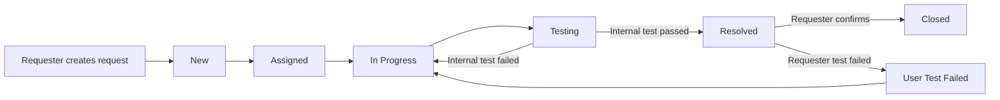

# IT Request Workflow System Backend Requirements

## 0. Document Information

| Field | Content |
| --- | --- |
| Feature name | IT Request Workflow System |
| Requirement type | PRD-standard + backend handoff appendix |
| Current status | Confirmed draft for backend and frontend alignment |
| Related modules | Portal, IT Workspace, Admin Console, Request Workflow, Permission, Audit |
| Updated at | 2026-08-11 |

This phase only builds an iTop-style IT request workflow: users submit requests, IT assigns and handles them, internal testers verify fixes, users confirm closure or report `User Test Failed`, and every change is logged.

## 1. Background And Goals

### 1.1 Background

The previous product direction included FAQ, knowledge base, service desk handling, Problem, Change and a broader iTop/ITSM feature set. The current requirement has been simplified and re-centered around a request handling workflow.

The system should keep the iTop-like operational style, but the business process is not a full iTop clone. It is a focused IT request tracking system with clear roles, status transitions, assignment, internal testing, user confirmation and auditable history.

### 1.2 Goals

- Allow ordinary users to create IT requests and track their own requests.
- Allow ordinary users to view other users' requests, but not operate on requests they do not own.
- Allow IT staff to assign, transfer, handle and test requests with relatively open internal permissions.
- Allow technicians to submit fixed requests to the test queue.
- Allow testers to pass requests to `Resolved` or return them to `In Progress`.
- Allow requesters to close resolved requests or mark them as `User Test Failed`.
- Allow Admin to manage users, roles, teams, code tables, routing rules and all request assignment.
- Keep `ITMD` as the default target team for every request unless an enabled routing rule overrides it.
- Record a request history entry for every creation, assignment, status change, comment, attachment and important field change.
- Keep all user-facing system pages and labels in English.

### 1.3 Non-goals

The following features are out of scope for this phase:

- FAQ and Knowledge Base.
- Service Desk Worker role and service desk queue.
- Real-time chat or instant messaging.
- Extra "Need More Information" status.
- Separate approval workflow.
- Separate `Test Failed` status. The only user-side failed state is `User Test Failed`; internal test failure returns to `In Progress`.
- Problem Management, Known Error, Change Management and SLA automation.
- Full iTop configurable workflow engine.

## 2. Users And Roles

### 2.1 Role Definitions

| Role | Product meaning | Main workspace | Core responsibility |
| --- | --- | --- | --- |
| `Requester` | Ordinary business user | Portal | Create requests, view requests, comment, confirm closure or report user test failure |
| `Technician` | IT handling person | IT Workspace | Handle assigned/team requests, add work notes, transfer to other technicians, submit to testing |
| `Tester` | IT internal tester | IT Workspace | Verify technician fixes, pass to resolved, or return to in progress |
| `Team Lead` | IT technical owner | IT Workspace | Own team queue, assign/reassign work, update workflow status, monitor workload |
| `Admin` | System owner and super team lead | Admin Console + IT Workspace | Manage users, roles, teams, routing rules, audit logs and all requests |

### 2.2 Admin Positioning

Admin is not a required workflow step. Admin has the highest permission and can act as a global Team Lead when needed.

Admin keeps only these functional areas:

- User Management
- Role And Permission Management
- Team Management
- Code Table Management for Request Type and Affected Service / System
- Request Type And Routing Rules
- Global Request Assignment And Reassignment
- Audit Logs
- System-level dashboards and counters

Admin should not include FAQ, Knowledge Base, service desk operations, Problem, Known Error or Change pages in this phase.

## 3. Core Workflow

### 3.1 Main Flow

### 3.2 Workflow Rules

- A new request starts as `New`.
- The system routes new requests to `ITMD` by default.
- Optional routing rules may override the default target team when explicitly enabled.
- If a technician is assigned immediately, the status becomes `Assigned`.
- Team Lead or Admin assigns `New` requests to technicians.
- Technician starts work by moving `Assigned` to `In Progress`.
- Technician submits completed work to `Testing`.
- Tester verifies the fix.
- If internal testing fails, Tester moves the request back to `In Progress`.
- If internal testing passes, Tester moves the request to `Resolved`.
- Requester performs user confirmation after `Resolved`.
- If user confirmation passes, Requester closes the request as `Closed`.
- If user confirmation fails, Requester marks the request as `User Test Failed`.
- `User Test Failed` returns the request to `In Progress` for rework.

## 4. Request Status Model

### 4.1 Status List

| Status | Meaning | Primary owner | User-visible |
| --- | --- | --- | --- |
| `New` | Request has been created and is waiting for assignment | Team Lead / Admin | Yes |
| `Assigned` | Request has an assigned technician but work has not started or has been reassigned | Technician | Yes |
| `In Progress` | Technician is actively handling or reworking the request | Technician | Yes |
| `Testing` | Technician has submitted the request for internal IT testing | Tester | Yes |
| `Resolved` | Internal test passed and requester confirmation is pending | Requester | Yes |
| `User Test Failed` | Requester found the issue is not fixed | Technician / Team Lead | Yes |
| `Closed` | Requester or Admin has confirmed final closure | None | Yes |

### 4.2 Status Change Permissions

| Change type | Allowed actor | Required note | Current frontend behavior |
| --- | --- | --- | --- |
| Select any workflow status from dropdown | Technician, Tester, Team Lead, Admin | Implemented; transition note is optional | IT Workspace Request Detail exposes all statuses in one dropdown |
| Confirm own resolved request as `Closed` | Requester, Admin | Optional confirmation note | Requester validation still belongs to Portal flow |
| Mark own resolved request as `User Test Failed` | Requester, Admin | Required user failure reason in backend | `User Test Failed` remains the only user-side failed status |
| Change assignee | Technician, Team Lead, Admin | Optional reassignment note | Assignment only selects assignee; team/org is displayed on the person option |

### 4.3 Status And Assignment Constraints

- Status jumps are allowed for permitted IT Workspace actors; the product no longer requires adjacent-only transitions.
- Frontend status and assignee changes use editable controls but share one page-level `Save` button.
- The page-level `Save` button must detect whether status changed, assignee changed, or both changed, then write only the relevant history events.
- If status or assignee changes are unsaved, leaving the detail page prompts `Cancel`, `Discard and Exit`, or `Save`.
- Backend validation should focus on role/scope permission, required notes for production-only rules, and audit/history writes.
- Assignment changes do not automatically change status.
- A technician transfer keeps the current status unless the actor explicitly saves a new status.

## 5. Permission Rules

### 5.1 Visibility

| Data scope | Requester | Technician | Tester | Team Lead | Admin |
| --- | --- | --- | --- | --- | --- |
| Own requests | Yes | Yes | Yes | Yes | Yes |
| Other users' requests | View only | Yes, if IT-visible | Yes, if in test/team scope | Yes, team scope | Yes |
| Team requests | No | Yes | Yes | Yes | Yes |
| All requests | View only public fields | Optional by permission | Optional by permission | Optional by permission | Yes |
| Internal work notes | No | Yes | Yes | Yes | Yes |
| Audit logs | No | No | No | Optional read-only | Yes |

### 5.2 Action Permissions

| Action | Requester | Technician | Tester | Team Lead | Admin |
| --- | --- | --- | --- | --- | --- |
| Create request | Yes | Yes | Yes | Yes | Yes |
| Edit own draft before submit | Not applicable in P0 | Not applicable | Not applicable | Not applicable | Not applicable |
| View others' requests | Yes, read-only | Yes | Yes | Yes | Yes |
| Comment on own request | Yes | Yes | Yes | Yes | Yes |
| Add internal work note | No | Yes | Yes | Yes | Yes |
| Assign request | No | Team-scope transfer only | No | Yes | Yes |
| Transfer to another technician | No | Yes, within allowed IT scope | No | Yes | Yes |
| Change workflow status by dropdown | No | Yes | Yes | Yes | Yes |
| Move to `User Test Failed` | Yes, only own request | No | No | No | Yes |
| Move to `Closed` | Yes, only own request | No | No | Optional | Yes |
| Manage users and roles | No | No | No | No | Yes |
| Manage teams and routing | No | No | No | Optional team scope | Yes |

### 5.3 Backend Enforcement

- All permission rules must be enforced in backend services, not only hidden in the frontend.
- Unauthorized operations return `403 Forbidden`.
- Invalid status transitions return a business validation error and must not write partial changes.
- Backend must not expose internal work notes to ordinary requesters.
- Admin overrides must still write request history and audit logs.

## 6. Page And Module Scope

All page names, menu labels, table headers, buttons, statuses and system messages must be in English.

### 6.1 Portal

Portal is for ordinary requesters.

Required pages:

- `Home`
- `New Request`
- `All Requests`
- `Ongoing Requests`
- `Closed Requests`
- `Request Detail`

Portal must not include FAQ or Knowledge Base entries.

### 6.2 IT Workspace

IT Workspace is for Technician, Tester, Team Lead and Admin.

Required pages:

- `Team Queue`
- `My Tasks`
- `Test Queue`
- `Request Detail`
- `Request Assignment`
- `Workload Overview`

### 6.3 Admin Console

Admin Console is for Admin.

Required pages:

- `Users`
- `Roles`
- `Permissions`
- `Teams`
- `Routing Rules`
- `Code Tables`
- `Requests`
- `Audit Logs`

## 7. Core Business Objects

### 7.1 Request

Request is the central business object.

Required product fields:

| Field | Meaning |
| --- | --- |
| Request No. | Human-readable unique number, for example `REQ-20260807-0001` |
| Title | Short request summary |
| Description | Rich request content; frontend supports basic formatting, pasted screenshots and code/error snippets |
| Request Type | Classification used for routing and reporting |
| Affected Service / System | Service or system affected by the request, for example ERP, Email, VPN or CRM |
| Priority | Business priority |
| Status | One of the confirmed statuses |
| Requester | User who created the request |
| Occurrence Time | When the issue first happened, used for log lookup and triage |
| Requested Resolution Time | User-requested target time for resolution; different from backend SLA due time |
| Assigned Team | IT team responsible for the request |
| Assignee | Current technician |
| Tester | Current or last tester |
| Created At | Request creation time |
| Updated At | Last meaningful update time |
| Submitted To Testing At | Latest time the request entered `Testing` |
| Resolved At | Latest time the request entered `Resolved` |
| Closed At | Time the request entered `Closed` |

### 7.2 Request Type

Request Type controls classification. Default routing stays on `ITMD`, and routing rules are optional overrides.

Request Type is maintained through the generic Code Tables module with `table_code = REQUEST_TYPE`. The request stores the selected stable `code`, while frontend pages display the configured `name`.

Examples:

- `ACCOUNT_ACCESS` / `Account Access`
- `APPLICATION_ISSUE` / `Application Issue`
- `NETWORK_ISSUE` / `Network Issue`
- `HARDWARE_ISSUE` / `Hardware Issue`
- `DATA_CORRECTION` / `Data Correction`
- `OTHER` / `Other`

Affected Service / System is maintained through the same Code Tables module with `table_code = AFFECTED_SERVICE`.

### 7.3 Routing Rule

Routing Rule maps Request Type and/or Priority to an optional override team.

Rules:

- If a matching enabled rule exists, a new request is assigned to that team.
- If no matching rule exists, the request is assigned to the default `ITMD` team.
- Routing rule does not have to assign a technician.
- Admin manages global routing rules.

### 7.4 Request History

Request History is the user-visible lifecycle log for each request.

Each history item must include:

- Request ID
- Event type
- Actor
- Timestamp
- Old value, when applicable
- New value, when applicable
- Public note, when applicable
- Internal note flag, when applicable

History must be append-only in this phase.

### 7.5 Request Comment

The system supports message-style comments, not real-time chat.

Rules:

- Requester comments are public.
- IT comments can be public or internal.
- Internal comments are visible only to IT roles and Admin.
- Comments create request history entries.
- Comment editing and deletion are out of scope for P0.

### 7.6 Attachment

Attachments are optional but recommended for screenshots and supporting files.

Rules:

- Request description can contain rich text and inline pasted images.
- Inline pasted images are part of request evidence and should be persisted safely by the backend.
- Backend must sanitize stored rich HTML and only allow safe tags, attributes and image/link URLs before serving it to other users.
- Attachment upload creates a request history entry.
- Requester can view public attachments.
- Internal attachments are visible only to IT roles and Admin.
- File size, file type and storage policy must be configurable.

## 8. Event And Logging Requirements

### 8.1 Request History Events

Every request must create logs for:

| Event | Trigger |
| --- | --- |
| `REQUEST_CREATED` | Requester creates a request |
| `REQUEST_ROUTED` | System assigns default team by routing rule |
| `REQUEST_ASSIGNED` | Team Lead/Admin assigns or reassigns technician |
| `REQUEST_TRANSFERRED` | Technician transfers request to another technician |
| `STATUS_CHANGED` | Any status transition |
| `COMMENT_ADDED` | Public or internal comment added |
| `ATTACHMENT_ADDED` | Attachment uploaded |
| `FIELD_UPDATED` | Important request field changed |
| `TEST_RESULT_ADDED` | Tester records pass or failure |
| `USER_TEST_FAILED` | Requester marks user test failed |
| `REQUEST_CLOSED` | Request enters `Closed` |

### 8.2 Audit Logs

Audit Logs are system-level security and administration logs.

Audit logs must cover:

- Login success and failure, if already supported by auth layer.
- User creation, update, disable and role assignment.
- Role and permission changes.
- Organization and team changes.
- Routing rule changes.
- Admin override on any request.

Request History and Audit Logs can share infrastructure, but their product purpose is different:

- Request History answers: "What happened to this request?"
- Audit Logs answer: "Who changed system data or sensitive permissions?"

## 9. Backend API Scope

This section records the implemented API contract. All paths are relative to the `/api` context path.

### 9.1 Authentication

| Capability | Notes |
| --- | --- |
| Login | Existing `POST /api/auth/login` can be reused |
| Current user | Return current user profile, roles and permissions |
| Logout | Optional for JWT if frontend only clears token |

### 9.2 Requests

| Capability | Implemented endpoint |
| --- | --- |
| Create request | `POST /api/requests` |
| List requests | `GET /api/requests` |
| Get request detail | `GET /api/requests/{id}` |
| Assign or transfer request | `PUT /api/requests/{id}/assign` |
| Set tester | `PUT /api/requests/{id}/tester` |
| Change status | `PUT /api/requests/{id}/status` |
| Update rich description | `PUT /api/requests/{id}/description` |
| Add comment | `POST /api/requests/{id}/comments` |
| List history | `GET /api/requests/{id}/history` |
| List comments | `GET /api/requests/{id}/comments` |
| Upload attachment | `POST /api/attachments/upload` with `entityType` and `entityId` |
| Download attachment | `GET /api/attachments/download/{id}` |
| List attachment metadata | `GET /api/attachments/by-entity` |
| Delete attachment | `DELETE /api/attachments/{id}` |

### 9.3 IT Workspace Queries

| Capability | Implemented query |
| --- | --- |
| Team queue | `GET /api/requests?teamId={id}` |
| My tasks | `GET /api/requests?assigneeId={currentUserId}` |
| Test queue | `GET /api/requests?status=Testing` |
| Unassigned candidates | `GET /api/requests`, then client prioritizes records without `agentId` |
| User requests | `GET /api/requests?callerId={currentUserId}` |
| Search/filter | `GET /api/requests` with `status`, `type`, `priority`, `teamId` or `search` |

### 9.4 Admin

| Capability | Implemented endpoint group |
| --- | --- |
| User management | `/api/users` |
| Role management | `/api/roles` |
| Permission dictionary | `/api/roles/permissions` |
| Team management | `/api/teams` |
| Routing rules | `/api/routing-rules` |
| Code tables | `/api/code-tables/{tableCode}/items` |
| Audit logs | `/api/audit-logs` |
| Dashboard | `/api/dashboard/stats` |

## 10. Data Model Handoff

The final implementation may reuse existing project entities where available. The following objects are required at product level.

| Product object | Suggested backend object/table | Notes |
| --- | --- | --- |
| User | `"user"` or existing user table | PostgreSQL reserved keyword must be quoted or renamed |
| Role | `role` | Existing module can be reused and simplified |
| Permission | role permission collection | Can remain JSON initially if backend validation is reliable |
| Team | `team` | IT team container |
| Team Member | `team_user_member` | Links authenticated users to workflow teams; legacy `team_member` remains for CMDB persons |
| Request Type | `code_table_item` with `table_code = REQUEST_TYPE` | Used for category and routing; request stores the selected code |
| Affected Service / System | `code_table_item` with `table_code = AFFECTED_SERVICE` | Used by New Request dropdown; request stores the selected code |
| Routing Rule | `routing_rule` | Maps request type to team |
| Request | `ticket` + `user_request` | Base ticket plus workflow request details and rich description |
| Request History | `ticket_history` | Append-only lifecycle log |
| Request Comment | `ticket_log` | Public/internal messages |
| Request Attachment | `attachment` | File metadata; content is stored under the configured upload directory |
| Audit Log | `audit_log` | Existing audit table can be reused if adequate |

## 11. Validation Rules

| Scenario | Backend behavior | User-visible feedback |
| --- | --- | --- |
| Missing title, affected service/system or description | Reject create/update | Required field message |
| Invalid request type | Reject create/update | Invalid request type |
| Disabled routing target team | Do not route to disabled team | Request remains `New` or admin sees configuration warning |
| Assign to inactive technician | Reject assignment | User is inactive |
| Assign to user without technician permission | Reject assignment | User cannot handle requests |
| Invalid status transition | Reject transition | Status transition is not allowed |
| Requester operates on others' request | Reject operation | Permission denied |
| Requester reads internal note | Hide internal note | No internal data exposed |
| Closed request is modified | Reject workflow changes | Request is closed |
| Concurrent update conflict | Reject stale update or use optimistic locking | Request was updated, refresh required |

## 12. Acceptance Criteria

### 12.1 Core Workflow

- A Requester can create a request and sees it as `New` or `Assigned` depending on routing/assignment.
- A Team Lead/Admin can assign a `New` request to a technician.
- A Technician can move an assigned request to `In Progress`.
- A Technician can transfer a request to another technician.
- A Technician can submit an `In Progress` request to `Testing`.
- A Tester can return a `Testing` request to `In Progress` with a failure reason.
- A Tester can move a `Testing` request to `Resolved` with a test result.
- A Requester can close a `Resolved` request.
- A Requester can mark a `Resolved` request as `User Test Failed`.
- `User Test Failed` can return to `In Progress` for rework.
- No actor can jump directly from `New` to `Closed`.

### 12.2 Permission

- Ordinary users can view other users' requests but cannot assign, transfer, change status, close, or fail requests they do not own.
- Ordinary users cannot see internal work notes.
- Technicians can transfer requests between technicians within allowed IT scope.
- Testers can operate the test queue.
- Team Leads can manage team assignment and adjacent status corrections.
- Admin can manage all users, roles, teams, routing rules and requests.

### 12.3 Logging

- Request creation writes `REQUEST_CREATED`.
- Routing writes `REQUEST_ROUTED`.
- Assignment and transfer write separate history events.
- Every status change writes `STATUS_CHANGED`.
- Tester pass/fail writes `TEST_RESULT_ADDED`.
- Requester failure writes `USER_TEST_FAILED`.
- Closure writes `REQUEST_CLOSED`.
- Admin configuration and permission changes write audit logs.

### 12.4 UI Language Contract

- All menu labels are English.
- All page titles are English.
- All status labels are English.
- All buttons and validation messages are English.
- Backend enums should use English stable values matching the status names or agreed enum keys.

## 13. Recommended Implementation Priority

### P0: Minimum Closed Loop

- Request entity, status model and transition validation.
- User roles and backend permission checks.
- Team and team member model.
- Request type and basic routing rule.
- Portal request creation, request list and request detail API support.
- IT workspace team queue, my tasks and test queue API support.
- Admin user, role, team, routing and assignment support.
- Request history for every request event.

### P1: Operational Completeness

- Attachment upload/download.
- Internal vs public comments.
- Workload counters.
- Audit log search/filter.
- Better public all-request visibility filters.
- Optimistic locking for concurrent operations.

### P2: Later Enhancements

- Notifications.
- Reopen after `Closed`.
- SLA and due-date automation.
- Report export.
- Configurable workflow.

## 14. Open Items

Only the following product or production-hardening decisions remain open:

- Whether users can view full descriptions and public comments, or only summary fields, for other users' requests.
- Whether IT queue visibility is global or restricted to team scope.
- Whether one Team Lead can own multiple teams.
- Whether `Closed` requests can be reopened in a later phase.
- Whether disabled users require a physical-delete operation.
- Whether audit-log export is required in P1.
- Docker/Flyway and multi-role end-to-end verification once Docker Desktop is available.

## 15. Implementation Sync - 2026-08-10

The workflow UI and Admin Console now use real backend APIs. Request rich text, pasted images, request/comment attachments, workflow teams, access control and audit history are implemented. Business mock data files have been removed. Docker runtime verification remains blocked because the local Docker daemon is not running.

### 15.1 Completed Application Items

| Area | Completed item | Evidence |
| --- | --- | --- |
| Login | Rebuilt English login entry with role cards backed by real seeded accounts; login page blocks browser zoom shortcuts that break layout | `itop-web/src/main/frontend/src/views/login/index.vue`, `src/stores/user.ts` |
| Requester Portal | Added Home, New Request, All Requests, Ongoing Requests, Closed Requests and Request Detail | `src/views/portal/*`, `src/views/requests/RequestDetail.vue` |
| New Request creation | Added requester-friendly fields, persisted rich text, pasted images and real attachments; client and server sanitize rich HTML | `src/views/portal/NewRequest.vue`, `src/api/requests.ts`, `src/api/attachments.ts`, `RequestController.java`, `AttachmentController.java` |
| IT Workspace | Added Workflow Overview, Team Queue, My Tasks, Test Queue and Assignment Desk | `src/views/workspace/*` |
| Admin Console | Reworked Admin Overview, Requests, Users, Roles, Permissions, Teams, Routing Rules, Code Tables and Audit Logs; all listed pages use real APIs; Organization page is removed | `src/views/dashboard/index.vue`, `src/views/system/*`, `src/api/system.ts` |
| Request UI components | Added status tags, priority tags, dropdown status editor, assignee picker and reusable request table | `src/components/RequestStatusTag.vue`, `PriorityTag.vue`, `RequestTable.vue`, `src/views/requests/RequestDetail.vue` |
| API contracts | Added shared request/system/attachment types and real API adapters; removed `mockAdmin.ts` and `mockRequests.ts` | `src/types/*`, `src/api/requests.ts`, `src/api/system.ts`, `src/api/attachments.ts` |
| Visual style | Applied iTop-like dark sidebar, light workspace, orange accent, softer buttons and cleaner table actions | `src/layouts/MainLayout.vue`, `src/layouts/UserPortalLayout.vue`, `src/styles/index.scss` |
| Taste-style polish | Removed global mobile overflow, refined Portal mobile header, wrapped request tables in controlled scroll containers and fixed Element Plus radio warnings | `src/styles/index.scss`, `src/layouts/UserPortalLayout.vue`, `src/components/PageHeader.vue`, `src/components/RequestTable.vue`, `src/views/portal/NewRequest.vue` |

### 15.2 Verified Frontend Behavior

| Verification | Result |
| --- | --- |
| Production build | `npm run build` passed after the 2026-08-10 real-API changes |
| Code Table build check | `npm run build` and `mvn -pl itop-api -am -DskipTests compile` passed after the 2026-08-11 Code Table changes |
| Backend compile and tests | `mvn -pl itop-api -am -DskipTests compile` and `mvn -pl itop-api -am test` passed; 5 tests, 0 failures/errors |
| Local page access | `/login`, `/portal`, `/workspace/overview`, `/users` returned HTTP 200 |
| Browser smoke test | Admin login, Workspace Overview, Users and Portal rendered in Chrome without console errors |
| Login zoom guard | Docker Chrome verified `Ctrl/Cmd + wheel` and `Ctrl/Cmd + +/-/0` are prevented on `/login`; Requester login redirects to `/portal`; no console errors or failed responses |
| Taste-style UI regression | Docker Chrome verified `/login`, `/portal`, `/portal/new-request`, `/workspace/overview` and `/users` have no horizontal page overflow, no console errors and no failed responses |
| Request Detail status/assignment | IT users can select any status; Requesters only see `Closed` and `User Test Failed` after `Resolved`; Assignment has no Team selector, options show team, and one Save persists changes |
| Task ordering | My Tasks sorts by priority then update time; Assignment Desk places unassigned requests first, then sorts by priority and update time |
| Duplicate action cleanup | `Users` page now has one primary `New User` action; row actions use dropdown menu |
| Language contract | New visible workflow pages are English |

### 15.3 Backend / API Sync

| Area | Current status | Remaining work |
| --- | --- | --- |
| Request API | `RequestController` supports list, detail, create, assign, tester, status, comments, history and statuses; Portal, Workspace, Admin Requests and Detail use `src/api/requests.ts` | Complete Docker end-to-end verification |
| Request creation validation | Backend create now requires Title, Affected Service / System and Description; Organization is no longer required | Add update validation when editable request fields are introduced |
| Routing | Routing Rule entity/service/controller and Admin UI use real CRUD APIs; request creation can auto-route by rule | Complete Docker routing verification |
| Status changes | Backend persists selected states and writes one history event per transition; Requester transitions are restricted to `Resolved -> Closed/User Test Failed` | Optimistic locking remains a later hardening item |
| Assignment | Backend persists team and agent assignment; `team_user_member` and `leader_user_id` map authenticated users; user options show team names | Confirm final team visibility scope |
| Comments | Backend supports public/internal comments and comment attachments; non-IT users cannot read internal comments | Complete Docker permission verification |
| Attachments / rich description | Request and comment attachments upload/download through protected APIs; rich HTML is persisted and sanitized by jsoup; pasted images reference attachment IDs | Compose now persists files in `request_uploads`; complete Docker volume verification |
| Auth | Backend JWT login and `/auth/me` exist; seeded workflow users are available with password `admin123`; login cards use these real accounts | Run container verification after Docker daemon is started |
| Team seed | V1.0.25 adds workflow team users and seeded teams; V1.0.29 makes `team.org_id` optional | Run Flyway migrations in the rebuilt API container |
| Admin APIs | Users, roles, permissions, teams, routing rules, code tables, audit logs and Dashboard use `src/api/system.ts` | Complete Docker CRUD verification |

### 15.4 Pending Product Confirmation

| Topic | Current assumption | Decision needed |
| --- | --- | --- |
| Old frontend files | Confirmed: keep old FAQ/Service/Problem/Change files hidden for now | No decision needed |
| Other users' request visibility | Organization access scope has been removed from the new request workflow | Confirm whether full descriptions/public comments or only summary fields are visible |
| User Test Failed note | Confirmed: reason is optional and attachments can be added through comments | No decision needed |
| Team scope | Cross-team transfer is confirmed and implemented | Confirm only the queue visibility scope and multi-team Team Lead behavior |
| Closed reopen | Closed is treated as terminal in this phase | Confirm whether reopen remains P2 |
| Attachment storage | Implemented as database metadata plus local file storage mounted to the `request_uploads` Docker volume | Revisit object storage only for production scaling |
| Login account strategy | Frontend cards use real seeded users: `requester01`, `technician01`, `tester01`, `lead01`, `admin`; password `admin123` | Verify after container rebuild |
| Team strategy | New Request no longer asks for an organization; all requests default to ITMD unless a routing rule overrides the team | Verify after Flyway runs in Docker |
| Docker environment | Code builds pass, but Docker compose cannot connect to `docker_engine` | Start Docker Desktop and rerun `docker compose up -d --build itop-api itop-web` |
